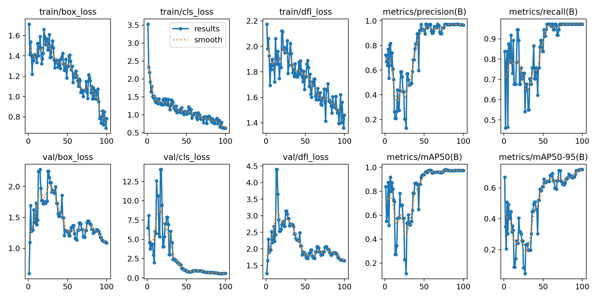

# YOLO 模型訓練成效分析指南 (Training Results Guide)

本文件是協助解讀 YOLO 訓練過程產生的 `results.png` 圖表，
並提供判斷模型狀態、過擬合徵兆及停止訓練時機的標準作業程序 (SOP)。

---

## 1. 圖表指標詳解 (Metrics & Losses)

訓練結果主要分為兩大類：**損失函數 (Losses)** 與 **評估指標 (Metrics)**。

### 損失函數 (Losses) - 越低越好
代表模型預測與真實答案的誤差值。

| 指標名稱 | 意義說明 | 實務解讀 (Debug 重點) |
| :--- | :--- | :--- |
| **`box_loss`** | **定位誤差** (Bounding Box Loss)           | 模型框得準不準？如果此值很高，代表框的位置歪斜或大小不貼合。 |
| **`cls_loss`** | **分類誤差** (Classification Loss)         | 物件認得對不對？如果此值很高，代表模型常把要偵測的物件誤認為背景或其他雜物。 |
| **`dfl_loss`** | **分佈焦點誤差** (Distribution Focal Loss) | 邊緣細節夠不夠好？在密集堆疊場景中，此指標越低，代表模型越能精確切分相鄰物件的邊界。 |

### 評估指標 (Metrics) - 越高越好 (Max 1.0)
代表模型的考試成績，用於驗收模型可用性。

| 指標名稱 | 意義說明 | 實務解讀 (KPI 重點) |
| :--- | :--- | :--- |
| **`Precision`** | **精確率**             | **寧缺勿濫**。數值低代表「誤報 (False Positive)」多，機器容易亂叫。 |
| **`Recall`**    | **召回率**             | **寧濫勿缺**。數值低代表「漏檢 (False Negative)」多，很多鋼樑沒抓到。 |
| **`mAP50`**     | **平均精度 (IoU=0.5)** | **核心指標**。預測框重疊超過 50% 就算對。這是判斷模型「能不能用」的第一關卡。 |
| **`mAP50-95`**  | **高精度平均精度**      | **品質指標**。要求更嚴格的重疊度。若需進行尺寸測量需看重此指標。 |

---

## 2. 指標重要性分級 (Priority)

並非所有指標都一樣重要，請依照以下優先順序進行評估：

### 第一級：關鍵績效指標 (Primary KPIs)
* **`mAP50`**：這是驗收的最底線。
    * **合格標準**：視專案需求而定，通常檢測要求 > 0.9 (90%)。
    * **決策**：如果 `mAP50` 不達標，模型直接判定不可用，無需看其他指標。

### 第二級：品質指標 (Secondary Quality)
* **`mAP50-95`**：決定模型的「精緻度」。
    * 如果只需「算數量」，此指標 0.6~0.7 即可。
    * 如果需「精密定位」，此指標需盡量衝高。

### 第三級：輔助診斷 (Diagnostic / Debug)
* **`Loss` 曲線**：工程師專用。
    * 當 mAP 上不去時，用來分析是「位置框不準 (`box_loss` 高)」還是「認錯東西 (`cls_loss` 高)」。

---

## 3. 如何從 Epoch 變化判斷模型狀態

觀察訓練曲線的走勢，我們可以將訓練過程分為三個階段：

### 階段一：摸索階段 (Exploration Phase)
* **特徵**：Loss 上下劇烈震盪，mAP 很低且不穩定。
* **狀態**：模型剛開始學習，正在尋找梯度下降的方向。
* **對策**：**耐心等待**，不要急著停止。

### 階段二：快速學習階段 (Rapid Learning Phase)
* **特徵**：Loss 大幅下降 (溜滑梯式)，Metrics (mAP) 快速爬升。
* **狀態**：模型「開竅了」，抓到了特徵規律。通常發生在優化器熱身結束或學習率下降時。
* **對策**：這是最關鍵的時期，確保沒有中斷訓練。

### 階段三：穩定收斂階段 (Convergence Phase)
* **特徵**：曲線變平 (Plateau)，數值微幅波動但維持高檔。
* **狀態**：模型學習已達瓶頸，進入微調階段。
* **對策**：準備評估是否停止訓練。

---

## 4. 如何判斷過擬合 (Overfitting)

過擬合代表模型「死背答案」，導致在訓練集表現滿分，但在新資料上表現很差。

### 危險訊號
請密切觀察 `val` (驗證集) 與 `train` (訓練集) 的差異：

1.  **交叉曲線 (The Crossing)**：
    * `train/loss` 持續 **下降** 
    * `val/loss` 反而開始 **上升** 
    * 這是最典型的過擬合徵兆。

2.  **精度倒退**：
    * `mAP` 達到最高點後，隨著訓練次數增加反而開始 **緩慢下跌**。

3.  **泛化能力差**：
    * 訓練圖表很完美，但拿一張現場新拍的照片去測，卻完全抓不到東西。

---

## 5. 決策指南：停止 vs. 繼續

### 情況 A：應該停止訓練 (Stop)
1.  **邊際效益遞減**：Loss 曲線已經平得像心電圖停止一樣 (Flatline)，且 mAP 連續 50 個 Epochs 沒有明顯提升 (< 0.1%)。
    * *案例*：Epoch 60 到 100 指標完全持平，多練只是浪費電。
2.  **出現過擬合**：確認 `val/loss` 開始反彈上升。
    * *操作*：應取用 Loss 最低點那一次的權重 (Best weights)，而非最後一次 (Last weights)。

### 情況 B：值得繼續訓練 (Continue)
1.  **曲線仍有斜率**：Loss 還在呈現下降趨勢，mAP 雖然慢但還在爬升。
2.  **震盪未穩**：曲線還在劇烈跳動，尚未收斂。
3.  **尚未達到 KPI**：mAP 還沒達到專案要求的及格線 (如 90%)，且 Loss 還沒探底。

---

> **總結建議**
> 對於物件計數專案，若 `mAP50` 已達 0.98 以上且曲線平穩 (如 Epoch 60 後)，即可停止訓練。過度追求 1.0 通常意義不大，應轉而關注模型在「不同光線/角度」下的泛化測試。